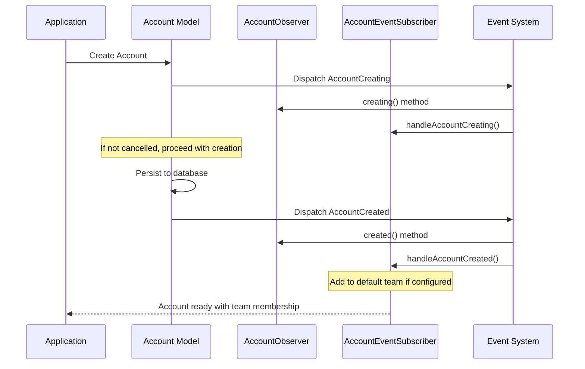

# Account Event-Driven Architecture

**I want to** implement a comprehensive event-driven architecture for the Account model  
**So that** I can ensure proper lifecycle management, audit trails, and business rule enforcement

## Acceptance Criteria

- [x] Account model dispatches events for all lifecycle operations
- [x] Observer pattern implementation for synchronized business logic
- [x] Event subscriber handles cross-cutting concerns (team membership)
- [x] Events provide consistent interface with Account model reference
- [x] Extensible architecture supports custom listeners and integrations
- [x] Proper event flow ensures data consistency and business rule compliance

## Technical Architecture

### Event Dispatching Mechanism

The Account model uses Laravel's built-in event dispatching through the `$dispatchesEvents` property:

```php
// Account.php
protected $dispatchesEvents = [
    'retrieved' => AccountRetrieved::class,
    'creating' => AccountCreating::class,
    'created' => AccountCreated::class,
    'updating' => AccountUpdating::class,
    'updated' => AccountUpdated::class,
    'saving' => AccountSaving::class,
    'saved' => AccountSaved::class,
    'deleting' => AccountDeleting::class,
    'deleted' => AccountDeleted::class,
    'replicating' => AccountReplicating::class,
];
```

### Observer Registration

The Account model uses the `ObservedBy` attribute for automatic observer registration:

```php
#[ObservedBy([AccountObserver::class])]
class Account extends Authenticatable
```

## Available Events

All Account events extend the abstract `AccountEvent` class, providing consistent structure and access to the Account instance.

### Base Event Class

**Location**: `modules/alpha/app/Models/Account/Events/AccountEvent.php`

```php
abstract class AccountEvent
{
    use Dispatchable, InteractsWithSockets, SerializesModels;

    public Account $account;

    public function __construct(Account $account)
    {
        $this->account = $account;
    }
}
```

### Lifecycle Events

#### Before Operations (Can Cancel)
1. **AccountCreating** - Fired before account creation, can prevent creation
2. **AccountUpdating** - Fired before account updates, can prevent updates
3. **AccountSaving** - Fired before any save operation (create/update)
4. **AccountDeleting** - Fired before account deletion, can prevent deletion
5. **AccountReplicating** - Fired before model replication

#### After Operations (Informational)
6. **AccountCreated** - Fired after successful account creation
7. **AccountUpdated** - Fired after successful account updates
8. **AccountSaved** - Fired after any successful save operation
9. **AccountDeleted** - Fired after successful account deletion
10. **AccountRetrieved** - Fired when account is retrieved from database

### Event Flow Diagram



## Observer Implementation

**Location**: `modules/alpha/app/Models/Account/Observers/AccountObserver.php`

The AccountObserver provides hooks for all lifecycle events with empty implementations ready for customization:

### Available Observer Methods

```php
class AccountObserver
{
    public function retrieved(Account $account): void { /* Custom logic */ }
    public function creating(Account $account): void { /* Pre-creation logic */ }
    public function created(Account $account): void { /* Post-creation logic */ }
    public function updating(Account $account): void { /* Pre-update logic */ }
    public function updated(Account $account): void { /* Post-update logic */ }
    public function saving(Account $account): void { /* Pre-save logic */ }
    public function saved(Account $account): void { /* Post-save logic */ }
    public function deleting(Account $account): void { /* Pre-delete logic */ }
    public function deleted(Account $account): void { /* Post-delete logic */ }
    public function replicating(Account $account): void { /* Pre-replication logic */ }
}
```

### Observer vs Event Listeners

**Use Observers For**:
- Direct model-related business logic
- Data validation and transformation
- Preventing operations (return false)
- Simple, tightly-coupled operations

**Use Event Listeners For**:
- Cross-cutting concerns
- External system integrations
- Complex business workflows
- Loose coupling requirements

## Event Subscriber

**Location**: `modules/alpha/app/Models/Account/Listeners/AccountEventSubscriber.php`

The AccountEventSubscriber handles cross-cutting concerns and automatic system behaviors.

### Current Implementation

#### Team Membership Automation
The subscriber automatically adds new accounts to the default team in single-team mode:

```php
public function handleAccountCreated(AccountCreated $event): void
{
    $settings = app(TenancySettings::class);

    if ($settings->isSingleTeamMode() && $settings->defaultTeam()) {
        Membership::firstOrCreate([
            'account_id' => $event->account->getKey(),
            'team_id' => $settings->defaultTeam()->getKey(),
        ]);
    }
}
```

#### Event Subscription Mapping
```php
public function subscribe(Dispatcher $events): array
{
    return [
        AccountRetrieved::class => 'handleAccountRetrieved',
        AccountCreating::class => 'handleAccountCreating',
        AccountCreated::class => 'handleAccountCreated',
        // ... all other events mapped to handlers
    ];
}
```

## Use Cases & Examples

### 1. Audit Logging Implementation

```php
// In AccountObserver
public function created(Account $account): void
{
    Log::info('Account created', [
        'account_id' => $account->id,
        'name' => $account->name,
        'created_by' => auth()->id(),
    ]);
}
```

### 2. Email Notification on Account Creation

```php
// Custom Event Listener
class SendWelcomeEmail
{
    public function handle(AccountCreated $event): void
    {
        Mail::to($event->account->email->value)
            ->send(new WelcomeEmail($event->account));
    }
}
```

### 3. Cache Invalidation

```php
// In AccountObserver
public function updated(Account $account): void
{
    Cache::forget("account.{$account->id}");
    Cache::tags(['accounts'])->flush();
}
```

### 4. Business Rule Enforcement

```php
// In AccountObserver
public function deleting(Account $account): bool
{
    // Prevent deletion if account has active subscriptions
    if ($account->subscriptions()->active()->exists()) {
        throw new \Exception('Cannot delete account with active subscriptions');
    }
    
    return true;
}
```

## Integration Points

### Custom Event Listeners

Register custom listeners in `EventServiceProvider`:

```php
protected $listen = [
    AccountCreated::class => [
        SendWelcomeEmail::class,
        CreateUserProfile::class,
        LogAccountCreation::class,
    ],
];
```

### Queue Integration

Events can be dispatched to queues for async processing:

```php
class ProcessAccountCreated implements ShouldQueue
{
    public function handle(AccountCreated $event): void
    {
        // Heavy processing in background
        $this->syncWithExternalSystem($event->account);
    }
}
```

## Test Scenarios *(Implementation Status: ✅ Ready for Testing)*

### Event Dispatching Tests
1. ⚠️ Account creation dispatches AccountCreating and AccountCreated events
2. ⚠️ Account updates dispatch AccountUpdating and AccountUpdated events
3. ⚠️ Account deletion dispatches AccountDeleting and AccountDeleted events
4. ⚠️ All events receive correct Account model instance

### Observer Method Invocation Tests
5. ⚠️ Observer methods are called in correct order during lifecycle
6. ⚠️ Observer can prevent operations by returning false
7. ⚠️ Observer receives accurate model state during events

### Event Subscriber Tests
8. ⚠️ AccountEventSubscriber handles all registered events
9. ✅ Team membership is created automatically for new accounts (current implementation)
10. ⚠️ Subscriber methods receive correct event instances

### Integration Tests
11. ⚠️ Custom event listeners are triggered correctly
12. ⚠️ Queued event listeners process asynchronously
13. ⚠️ Event system works correctly with database transactions

*Note: Event testing infrastructure is ready for comprehensive test implementation covering all lifecycle scenarios and integration points.*

## Best Practices

### Event Naming
- Use descriptive, past-tense names for completed events
- Use present-continuous tense for preventable events
- Follow Laravel conventions: `ModelAction` and `ModelActioning`

### Performance Considerations
- Use queued listeners for heavy operations
- Avoid N+1 queries in event handlers
- Consider event sourcing for complex business logic

### Error Handling
- Wrap event handlers in try-catch blocks
- Log errors without breaking main application flow
- Consider failed job handling for queued listeners

### Testing Strategy
- Mock events in unit tests when testing business logic
- Test event dispatching separately from business logic
- Use event fakes for integration testing